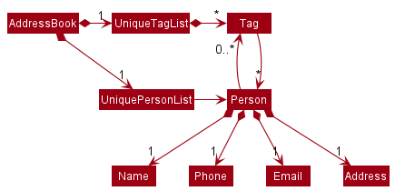
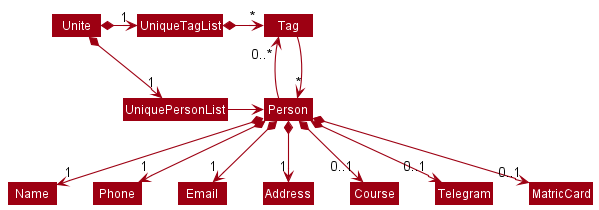
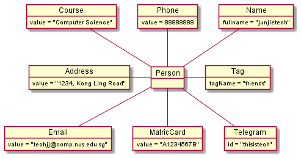
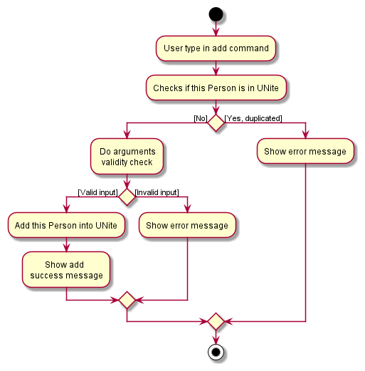
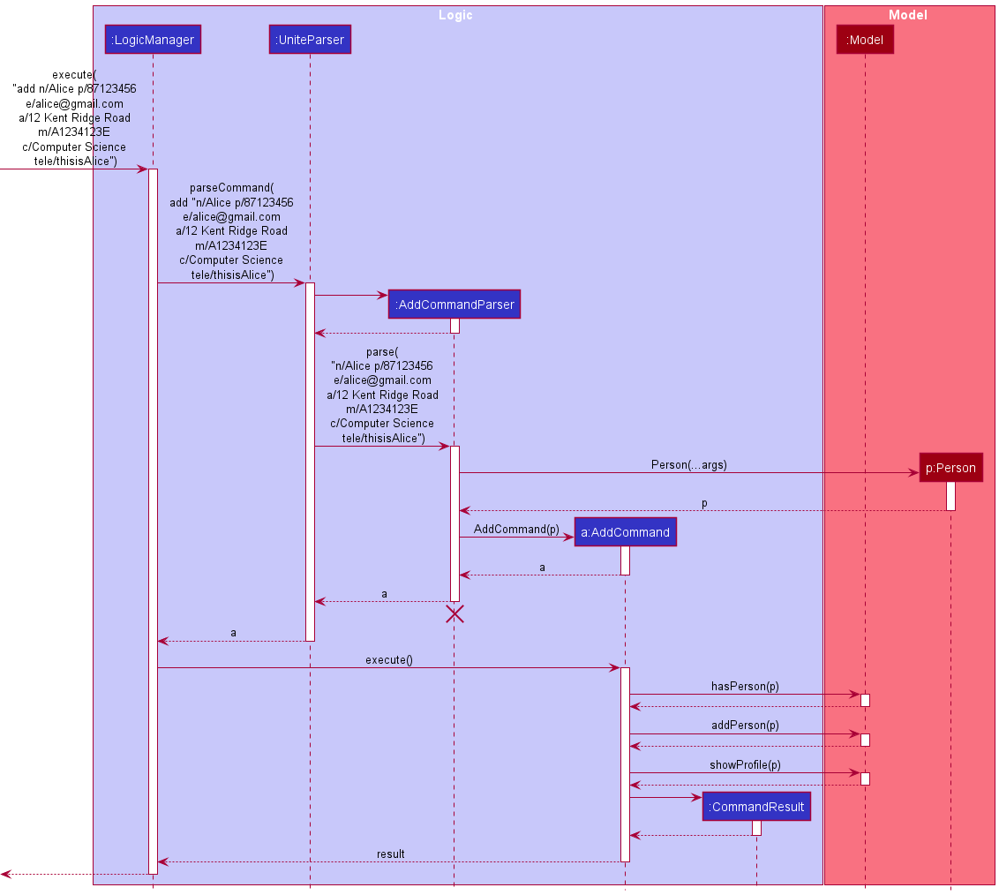
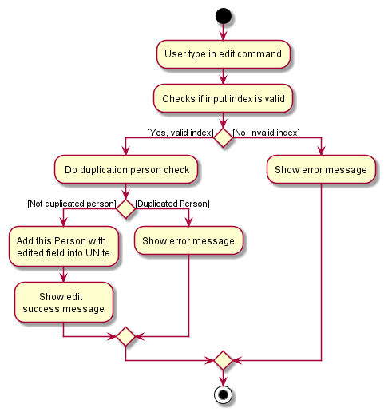
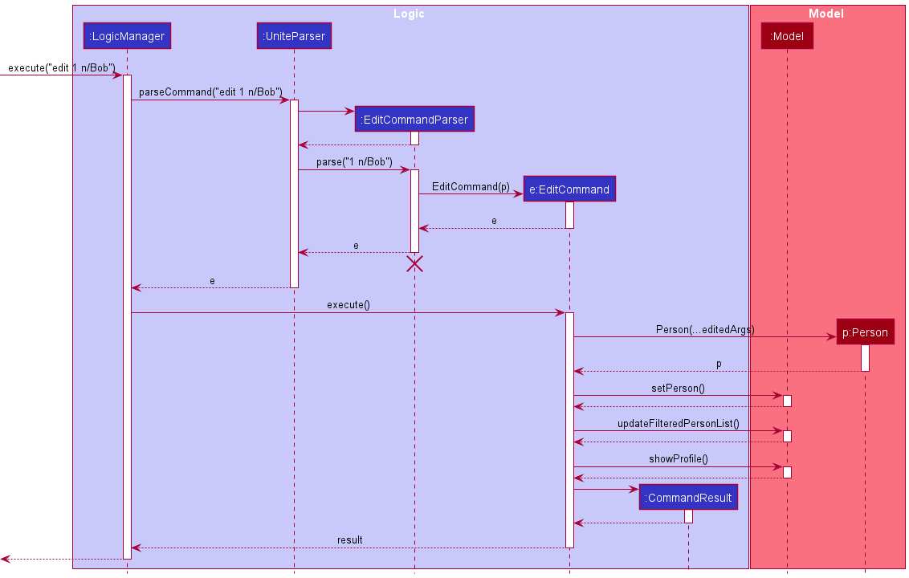
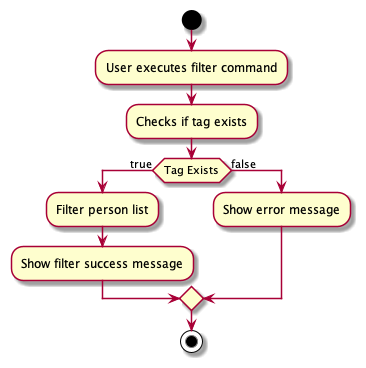
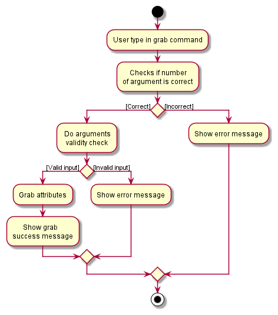

* Table of Contents
{:toc}

--------------------------------------------------------------------------------------------------------------------

## **Acknowledgements**

* This project is based on the AddressBook-Level3 project created by the [SE-EDU initiative](https://se-education.org).
* Libraries used: [JavaFX](https://openjfx.io/), [Jackson](https://github.com/FasterXML/jackson), [JUnit5](https://github.com/junit-team/junit5)

--------------------------------------------------------------------------------------------------------------------

## **Setting up, getting started**

Refer to the guide [_Setting up and getting started_](SettingUp.md).

--------------------------------------------------------------------------------------------------------------------

## **Design**

:bulb: **Tip:** The `.puml` files used to create diagrams in this document can be found in the [diagrams](https://github.com/se-edu/addressbook-level3/tree/master/docs/diagrams/) folder. Refer to the [_PlantUML Tutorial_ at se-edu/guides](https://se-education.org/guides/tutorials/plantUml.html) to learn how to create and edit diagrams.

### Architecture

The ***Architecture Diagram*** given above explains the high-level design of the App.

Given below is a quick overview of main components and how they interact with each other.

**Main components of the architecture**

**`Main`** has two classes called [`Main`](https://github.com/se-edu/addressbook-level3/tree/master/src/main/java/seedu/address/Main.java) and [`MainApp`](https://github.com/se-edu/addressbook-level3/tree/master/src/main/java/seedu/address/MainApp.java). It is responsible for,
* At app launch: Initializes the components in the correct sequence, and connects them up with each other.
* At shut down: Shuts down the components and invokes cleanup methods where necessary.

[**`Commons`**](#common-classes) represents a collection of classes used by multiple other components.

The rest of the App consists of four components.

* [**`UI`**](#ui-component): The UI of the App.
* [**`Logic`**](#logic-component): The command executor.
* [**`Model`**](#model-component): Holds the data of the App in memory.
* [**`Storage`**](#storage-component): Reads data from, and writes data to, the hard disk.

**How the architecture components interact with each other**

The *Sequence Diagram* below shows how the components interact with each other for the scenario where the user issues the command `delete 1`.

Each of the four main components (also shown in the diagram above),

* defines its *API* in an `interface` with the same name as the Component.
* implements its functionality using a concrete `{Component Name}Manager` class (which follows the corresponding API `interface` mentioned in the previous point.

For example, the `Logic` component defines its API in the `Logic.java` interface and implements its functionality using the `LogicManager.java` class which follows the `Logic` interface. Other components interact with a given component through its interface rather than the concrete class (reason: to prevent outside component's being coupled to the implementation of a component), as illustrated in the (partial) class diagram below.

The sections below give more details of each component.

### UI component

The **API** of this component is specified in [`Ui.java`](https://github.com/se-edu/addressbook-level3/tree/master/src/main/java/seedu/address/ui/Ui.java)

The UI consists of a `MainWindow` that is made up of parts e.g.`CommandBox`, `ResultDisplay`, `PersonListPanel`, `StatusBarFooter` etc. All these, including the `MainWindow`, inherit from the abstract `UiPart` class which captures the commonalities between classes that represent parts of the visible GUI.

The `UI` component uses the JavaFx UI framework. The layout of these UI parts are defined in matching `.fxml` files that are in the `src/main/resources/view` folder. For example, the layout of the [`MainWindow`](https://github.com/se-edu/addressbook-level3/tree/master/src/main/java/seedu/address/ui/MainWindow.java) is specified in [`MainWindow.fxml`](https://github.com/se-edu/addressbook-level3/tree/master/src/main/resources/view/MainWindow.fxml)

The `UI` component,

* executes user commands using the `Logic` component.
* listens for changes to `Model` data so that the UI can be updated with the modified data.
* keeps a reference to the `Logic` component, because the `UI` relies on the `Logic` to execute commands.
* depends on some classes in the `Model` component, as it displays `Person` object residing in the `Model`.

### Logic component

**API** : [`Logic.java`](https://github.com/se-edu/addressbook-level3/tree/master/src/main/java/seedu/address/logic/Logic.java)

Here's a (partial) class diagram of the `Logic` component:

How the `Logic` component works:
1. When `Logic` is called upon to execute a command, it uses the `UniteParser` class to parse the user command.
1. This results in a `Command` object (more precisely, an object of one of its subclasses e.g., `AddCommand`) which is executed by the `LogicManager`.
1. The command can communicate with the `Model` when it is executed (e.g. to add a person).
1. The result of the command execution is encapsulated as a `CommandResult` object which is returned back from `Logic`.

The Sequence Diagram below illustrates the interactions within the `Logic` component for the `execute("delete 1")` API call.

:information_source: **Note:** The lifeline for `DeleteCommandParser` should end at the destroy marker (X) but due to a limitation of PlantUML, the lifeline reaches the end of diagram.

Here are the other classes in `Logic` (omitted from the class diagram above) that are used for parsing a user command:

How the parsing works:
* When called upon to parse a user command, the `UniteParser` class creates an `XYZCommandParser` (`XYZ` is a placeholder for the specific command name e.g., `AddCommandParser`) which uses the other classes shown above to parse the user command and create a `XYZCommand` object (e.g., `AddCommand`) which the `UniteParser` returns back as a `Command` object.
* All `XYZCommandParser` classes (e.g., `AddCommandParser`, `DeleteCommandParser`, ...) inherit from the `Parser` interface so that they can be treated similarly where possible e.g, during testing.

### Model component
**API** : [`Model.java`](https://github.com/se-edu/addressbook-level3/tree/master/src/main/java/seedu/address/model/Model.java)

The `Model` component,

* stores the UNite data i.e., all `Person` objects (which are contained in a `UniquePersonList` object).
* stores the currently 'selected' `Person` objects (e.g., results of a search query) as a separate _filtered_ list which is exposed to outsiders as an unmodifiable `ObservableList<Person>` that can be 'observed' e.g. the UI can be bound to this list so that the UI automatically updates when the data in the list change.
* stores a `UserPref` object that represents the user’s preferences. This is exposed to the outside as a `ReadOnlyUserPref` objects.
* does not depend on any of the other three components (as the `Model` represents data entities of the domain, they should make sense on their own without depending on other components)

:information_source: **Note:** An alternative (arguably, a more OOP) model is given below. It has a `Tag` list in the `Unite`, which `Person` references. This allows `Unite` to only require one `Tag` object per unique tag, instead of each `Person` needing their own `Tag` objects. 

### Storage component

**API** : [`Storage.java`](https://github.com/se-edu/addressbook-level3/tree/master/src/main/java/seedu/address/storage/Storage.java)

The `Storage` component,
* can save both UNite data and user preference data in json format, and read them back into corresponding objects.
* inherits from both `UniteStorage` and `UserPrefStorage`, which means it can be treated as either one (if only the functionality of only one is needed).
* depends on some classes in the `Model` component (because the `Storage` component's job is to save/retrieve objects that belong to the `Model`)

### Common classes

Classes used by multiple components are in the `seedu.unite.commons` package.

--------------------------------------------------------------------------------------------------------------------

## **Implementation**

This section describes some noteworthy details on how certain features are implemented.

### **Enhanced Person Object**

#### Rationale
Person object needs to be enhanced to contain more relevant attributes to suit the target audiences.

#### Implementation
In the original add profile feature in the AB3 Address Book, all the `Person` objects are being stored in the `Unite`.

Now in UNite, we are storying them in `Unite`.

Within it, it contains two class, i) `UniquePersonList` that keep tracks of the `Person` in UNite, and
ii) `UniqueTagList` that keep tracks of the `Tag` in UNite.

In the original AB3 address book, eachj `Person` object consist of various attributes such as `Name`, `Phone`, `Address`, `Email` and `Tag`. Here shows a
diagram of a class diagram of the profiles in the AB3 Address Book.

In UNite, each `Person` object is being enhanced and modified in order to fits the needs of our target users
(ie university professors, teaching assistants and students). More classes are added to be associated to the `Person` class,
this includes `Course` class, `MatricCard` class and `Telegram` class. The updated class diagram for UNite can be found below.

Consider the following commands.

`add n/junjieteoh p/88888888 e/teohjj@comp.nus.edu.sg a/1234, Kong Ling Road t/friends m/A1234567B tele/thisisteoh c/Computer Science`

This is a sample of the `Person` object diagram.

#### Design Consideration 
Aspect: Implementation of `Telegram`, `Course` and `MatricCard` classes 
- **Alternative 1 (current choice):**   
The `Telegram`, `Course` and `MatricCard` classes are implemented as individual classes that are associated with `Person`. This is similar to how the inbuilt AB3 classes (ie `Name`, `Email`, `Address` ...) are implemented.
    - Pros: Easy to implement
    - Cons: Whenever you want to add more attributes you have to add in more fields in `Person` object.
- **Alternative 2:**  
Abstract school related classes such as `Email`, `Course` and `MatricCard` such that these classes are associated with a new class (ie `SchoolInfo` class). Each Person object will just have to store one or many `SchoolInfo` object as its field.
    - Pros: Allow more complicated interactions. For example, we can now allow each `Person` object to store multiple `SchoolInfo` objects (each with a different `Email`, `MatricCard` and `Course`). This can simulate scenarios of students going to another university for exchange (hence having different `SchoolInfo`).
    - Cons: A huge refactoring is needed to change the internal structure of `Person` object. Not reccomended.

We sticked to **Alternative 1** which was the easier option for implementation. We are only targeting one university as of now, so it is a good assumption that school related information such as `MatricCard`, `Email` and `Course` are unique so the pros in **Alternative 2** may be less relevant in UNite.

**Aspect: Optional `Telegram`, `Course` and `MatricCard` fields**  
These fields are set as optional. When users choose not to key in these fields, it will be set to a default value of an empty String "".   
The regex of these three classes has been modified to accept the empty String "" as a valid input command, but internally any `Telegram`, `Course` and `MatricCard` with value of "" means that the field is left blank and unfilled. 

 

### **Add Person feature**
#### Rationale 
The add command allows user to add a new `Person` into UNite.

#### Implementation
The add profile feature receives input from the users (with the relevant attributes) and create a `Person` object with these attributes and add it into UNite.
* `AddCommand` extending class `Command` is implemented to let the system understand the command
* `AddCommandParser`is implemented to parse the filter command entered by user.

The activity diagram below summarizes what happens when an add command is executed.

Given below is an example usage scenario of grab command.

Step 1. UNite is opened by the user and ready to receive commands. The user types in the command `add n/Alice p/87123456 e/alice@gmail.com a/12 Kent Ridge Road m/A1234123E c/Computer Science tele/thisisAlice`.

Step 2. The command is passed from `logic.LogicManager`into `logic.parser.UniteParser` which creates a `AddCommandParser` object.

Step 3. The `AddCommandParser` parses the arguments using `ArgumentTokenizer` and returns a `AddCommand` object
if there is no parse exception.

Step 4. During the execution of add command, a `CommandException` is thrown if the input is invalid (see activity diagram above). Otherwise a `CommandResult` containing the details of the new `Person` as a String is returned.

#### Design Consideration
**Aspect: Duplication check**  
* **Alternative 1 (current choice):**   The check is done late in `AddCommand`. `Person` object created before the duplication check.
    * Pros: Easy to implement.
    * Cons: May have performance issues in terms of memory usage since unnecessary objects may be created.

* **Alternative 2:**   Early duplication check in `AddCommandParser` itself.
    * Pros: Prevent unnecessary creation of `Person` object. 
    * Cons: May need heavy refactoring. 

**Aspect: Duplication criteria**  
* **Alternative 1 (current choice):**   Two `Person` are considered the same `Person` if
    * They have the same `Name` (case-insensitive).
    * At least one of following fields: `Email`, `Phone`, `Address`, `MatricCard`) is the same (case-insensitive) between these two `Person`.
    
You can redefine your own criteria if you want to. Simply modify `Person#isSamePerson()` to define your own criteria.

### **Edit Person feature**
#### Rationale
The edit command allows user to edit an existing `Person` in UNite.

#### Implementation
The edit profile feature receives input from the users (with the relevant attributes). The edit is facilitated by `EditPersonDescriptor`, which stores the details of the `Person` that needs to be changed.
* `EditCommand` extending class `Command` is implemented to let the system understand the command
* `EditCommandParser`is implemented to parse the filter command entered by user.

The activity diagram below summarizes what happens when an add command is executed.

Given below is an example usage scenario of edit command.

Step 1. UNite is opened by the user and ready to receive commands. Assuming there is already one `Person` added in UNite. The user types in the command `edit 1 n/Bob`.

Step 2. The command is passed from `logic.LogicManager`into `logic.parser.UniteParser` which creates a `EditCommandParser` object.

Step 3. The `EditCommandParser` parses the arguments using `ArgumentTokenizer` and returns a `EditCommand` object
if there is no parse exception.

Step 4. During the execution of edit command, a `CommandException` is thrown if the input is invalid (see activity diagram above). Otherwise a `CommandResult` containing the details of the new `Person` as a String is returned.

#### Design Consideration
**Aspect: Creation of edited `Person` object**  
* **Alternative 1 (current choice):**   Everytime a field get edited, a new `Person` object is created to replace the original `Person` in UNite. 
    * Pros: Ensure immutability. Easy to implement. 
    * Cons: Many object creations.

* **Alternative 2:**   Update the field in the original `Person` object directly.
  itself.
    * Pros: Lesser creation of `Person` object.
    * Cons: Needs to be implemented carefully to make sure there will not be any side effects. 

We decided to go with **Alternative 1**, which ensures immutability and no side effects.

### **Filter feature**

#### Rationale
The filter feature receives a tag name input from the user and filters out the profiles that has the given tag attached.

#### Implementation
To implement the feature, the below classes are created:

* `FilterCommand` extending class `Command` is implemented to let the system understand the command
* `FilterCommandParser`is implemented to parse the filter command entered by user.
* `PersonContainsTagPredicate` extends class Predicate<Person> to assist in filtering out the profiles that contains
  the given tag

The activity diagram below summarizes what happens when a filter command is executed.

The sequence diagram below illustrates how the filter command works, using `'filter family'` as the sample input.

Given below is an example usage scenario of filter command.

Step 1. UNite is opened by the user and ready to receive commands. The user types in the command `filter family`.

Step 2. The command is passed from `logic.LogicManager`into `logic.parser.UniteParser` which creates a `FilterCommandParser` object.

Step 3. The `FilterCommandParser` parses the arguments using `ArgumentTokenizer` and returns a `FilterCommand` object
if there is no parse exception. In the creation of a new `FilterCommand` object, the tag name is parsed out and a new
`PersonContainsTagPredicate` object is created.

Step 4. During the execution of filter command, a `CommandException` is thrown if the tag does not exist in the model.
Otherwise, the profile list is filtered using the predicate.

#### Design considerations

The filter feature was implemented in such a way that it aligns with the format of all other commands. This helps to enhance readability.

### **Grab Command**
#### Rationale
The grab feature allows user to grab any attribute (as defined in [Enchanced Person Object](#) (except `Tag`) of anyone in UNite. The grab result will be displayed in UNite and users can efficiently compile the needed data.

#### Implementation
There are two class related to grab features, they are `GrabCommand` and `GrabCommandParser`. Note the following relationship:
* `GrabCommand` is a class extending `Command` class. The Command object will then be executed. Read [here](#logic-component) to understand how `Command` works.
* `GrabCommandParser` is a class extending the `Parser` class, it is used to parse the command entered by user.

The activity diagram below summarizes what happens when a grab command is executed.
In short, there are three possible "Valid input" for user can grab something.
1. Provide one valid attribute (except `Tag`) with one index, grab this attribute from the `Person` with this index.
2. Provide one attribute (except `Tag`) and one Tag, grab this attribute from every `Person` with this Tag.
3. Provide one attribute (except `Tag`) with no index, grab this attribute from every `Person` in UNite.

Given below is an example usage scenario of grab command.

Step 1. UNite is opened by the user and ready to receive commands. The user types in the command `grab tele/1`.

Step 2. The command is passed from `logic.LogicManager`into `logic.parser.UniteParser` which creates a `GrabCommandParser` object.

Step 3. The `GrabCommandParser` parses the arguments using `ArgumentTokenizer` and returns a `GrabCommand` object
if there is no parse exception.

Step 4. During the execution of grab command, a `CommandException` is thrown if the input is invalid (see activity diagram above). Otherwise, Otherwise a `CommandResult` containing the String of the attribute being grabbed from the correct `Person` is returned to user.

#### Design Consideration
**Aspect: Constraints on Input**  
There are multiple constraints on the inputs allowed for this command. Here are our rationale why.

- **Valid attributes include all attributes EXCEPT tag**  
We decided to leave the grabbing of tag out because this function can already been done by another command (`list_tag`) in UNite. This command is way more powerful than the grab command in terms of tag manipulations.

- **When tag exists, you cannot include index**  
This constraint is put in placed to avoid unnecessary confusion for the users. By allowing users to key in index (when the tag is present), it may create confusion of whether this index refers to the index when all the `Person` are present in UNite, or the filtered list with this tag.  
Hence, we avoided this potential confusion by imposing an additional constraint to this command.

:information_source: **Note:** The lifeline for `GrabCommandParser` should end at the destroy marker (X) but due to a limitation of PlantUML, the lifeline reaches the end of diagram.

### **\[Proposed\] Undo/redo feature**

#### Proposed Implementation

The proposed undo/redo mechanism is facilitated by `VersionedUnite`. It extends `Unite` with an undo/redo history, stored internally as an `uniteStateList` and `currentStatePointer`. Additionally, it implements the following operations:

* `VersionedUnite#commit()` — Saves the current UNite state in its history.
* `VersionedUnite#undo()` — Restores the previous UNite state from its history.
* `VersionedUnite#redo()` — Restores a previously undone UNite state from its history.

These operations are exposed in the `Model` interface as `Model#commitUnite()`, `Model#undoUnite()` and `Model#redoUnite()` respectively.

Given below is an example usage scenario and how the undo/redo mechanism behaves at each step.

Step 1. The user launches the application for the first time. The `VersionedUnite` will be initialized with the initial UNite state, and the `currentStatePointer` pointing to that single UNite state.

Step 2. The user executes `delete 5` command to delete the 5th person in the UNite. The `delete` command calls `Model#commitUnite()`, causing the modified state of the UNite after the `delete 5` command executes to be saved in the `uniteStateList`, and the `currentStatePointer` is shifted to the newly inserted UNite state.

Step 3. The user executes `add n/David …​` to add a new person. The `add` command also calls `Model#commitUnite()`, causing another modified UNite state to be saved into the `uniteStateList`.

:information_source: **Note:** If a command fails its execution, it will not call `Model#commitUnite()`, so the UNite state will not be saved into the `uniteStateList`.

Step 4. The user now decides that adding the person was a mistake, and decides to undo that action by executing the `undo` command. The `undo` command will call `Model#undoUnite()`, which will shift the `currentStatePointer` once to the left, pointing it to the previous UNite state, and restores the UNite to that state.

:information_source: **Note:** If the `currentStatePointer` is at index 0, pointing to the initial Unite state, then there are no previous Unite states to restore. The `undo` command uses `Model#canUndoUnite()` to check if this is the case. If so, it will return an error to the user rather
than attempting to perform the undo.

The following sequence diagram shows how the undo operation works:

:information_source: **Note:** The lifeline for `UndoCommand` should end at the destroy marker (X) but due to a limitation of PlantUML, the lifeline reaches the end of diagram.

The `redo` command does the opposite — it calls `Model#redoUnite()`, which shifts the `currentStatePointer` once to the right, pointing to the previously undone state, and restores the UNite to that state.

:information_source: **Note:** If the `currentStatePointer` is at index `uniteStateList.size() - 1`, pointing to the latest UNite state, then there are no undone Unite states to restore. The `redo` command uses `Model#canRedoUnite()` to check if this is the case. If so, it will return an error to the user rather than attempting to perform the redo.

Step 5. The user then decides to execute the command `list`. Commands that do not modify the UNite, such as `list`, will usually not call `Model#commitUnite()`, `Model#undoUnite()` or `Model#redoUnite()`. Thus, the `uniteStateList` remains unchanged.

Step 6. The user executes `clear`, which calls `Model#commitUnite()`. Since the `currentStatePointer` is not pointing at the end of the `uniteStateList`, all UNite states after the `currentStatePointer` will be purged. Reason: It no longer makes sense to redo the `add n/David …​` command. This is the behavior that most modern desktop applications follow.

The following activity diagram summarizes what happens when a user executes a new command:

#### Design considerations:

**Aspect: How undo & redo executes:**

* **Alternative 1 (current choice):** Saves the entire address book.
  * Pros: Easy to implement.
  * Cons: May have performance issues in terms of memory usage.

* **Alternative 2:** Individual command knows how to undo/redo by
  itself.
  * Pros: Will use less memory (e.g. for `delete`, just save the person being deleted).
  * Cons: We must ensure that the implementation of each individual command are correct.

_{more aspects and alternatives to be added}_

### View detailed profile
In the original AB3 Address Book, all information about a person are displayed within the respective `PersonCard`. This
limits the amount of information a user can see at one time. If simply increase the size, or more specifically, the
height of a `PersonCard`, less person will be displayed of the same window size.

Therefore, in UNite, the main display window has been divided into two parts. On the left-hand side, it is the
conventional `PersonListPanel`, on the right-hand side, is the newly implemented `Profile` window to display more
information about a person.

### **Theme choosing**
In the original AB3 Address Book, there is no choice for the user to style up the appearance of the application. Given
that the target users of UNite are school admins and students, we want to give users a choice to change between a light and a
dark theme, so that the application fits better to the vibrant energy of a university.

--------------------------------------------------------------------------------------------------------------------

## **Documentation, logging, testing, configuration, dev-ops**

* [Documentation guide](Documentation.md)
* [Testing guide](Testing.md)
* [Logging guide](Logging.md)
* [Configuration guide](Configuration.md)
* [DevOps guide](DevOps.md)

--------------------------------------------------------------------------------------------------------------------

## **Appendix: Requirements**

### Product scope

**Target user profile**:

* has a need to manage a significant number of contacts (in the university)
* prefer desktop apps over other types
* Prefer an app with a simplistic GUI design

**Value proposition**: help university Students and TAs to manage multiple project or tutorial groups, and help school admins to manage module groups.

### User stories

Priorities: High (must have) - `* * *`, Medium (nice to have) - `* *`, Low (unlikely to have) - `*`

| Priority | As a …​                                    | I want to …​                     | So that I can…​                                                        |
| -------- | ------------------------------------------ | ------------------------------ | ---------------------------------------------------------------------- |
| `* * *`  | user                   | add someone’s contact information        | update UNite or contact him/her if I need to|
| `* * *`  | user                   | delete someone’s contact information     |   clear and organize my contact list  if I need to |
| `* * *`  | user                   | view a particular existing profile       | know his/her information such as name, year of study and faculty  |
| `* * *`  | user                   | edit a profile                           | update the information if it is wrong or inaccurate|
| `* * *`  | school admin           | see all the modules (as tags) in a list form | know my job scope for this semester|
| `* * *`  | school admin/TA        | add a module tag to a student            |  keep the module enrolment status updated|
| `* * *`  | school admin/TA        | delete a module tag from a student       | keep the module enrolment status updated|
| `* * *`  | school admin/TA        | create a new module tag                  | add in a module that I am supposed to moderate/teach|
| `* * *`  | school admin/TA        | delete an existing module tag            | remove a module if I no longer need to moderate the module|
| `* * *`  | student                |  find my peers’ contact information in a module's tutorial/lab tag | contact them for help if I need any|
| `* *`    | user                   | delete multiple contacts in one go       | clear and organize my contact list more effiiciently|
| `* *`    | school admin           |  import a list of students along with the tags they have | set up student profiles and their module information in the application when the semester starts|
| `*`      | school admin           |  see the number of students enrolled in every module | know about the enrolment status|

*{More to be added}*

### Use cases

(For all use cases below, the **System** is `UNite` and the **Actor** is the `user`, unless specified otherwise)

**Use case: Attach an existing tag to a user profile**

**MSS**

1.  User requests to list persons
2.  UNite shows a list of persons
3.  User selects a profile in the list
4.  UNite shows detail of the profile
5.  User request to attach tag to the selected profile
6.  UNite adds tag to profile

    Use case ends.

**Extensions**

* 2a. The list is empty.

  Use case ends.

* 3a. The given index is invalid.

    * 3a1. UNite shows an error message.

      Use case resumes at step 2.

* 5a. Tag is already attached to the profile
    * 5a1. UNite shows an error message

      Use case resumes at step 5.

* 5b. Tag does not exist
    * 5b1. UNite shows an error message

      Use case resumes at step 5.

**Use case: Edit an existing user profile**

**MSS**

1. User requests to list persons
2. UNite shows a list of persons
3. User selects a profile in the list
4. UNite shows detail of the profile
5. User request to edit the selected profile
6. UNite shows panel for editing
7. User make edits to the profile
8. User saves the profile
9. UNite updates and saves the profile

    Use case ends.

**Extensions**

* 2a. The list is empty.

  Use case ends.

* 7a. User makes invalid edits

  UNite prompts user with the invalid edit.

  Use case repeats at step 7 until user edits are valid.

* 8a. User cancels the editing

  User case ends.

*{More to be added}*

### Non-Functional Requirements

1. Should work on any _mainstream OS_ as long as it has Java `11` or above installed.
2. Should be able to hold up to 1000 persons without a noticeable sluggishness in performance for typical usage.
3. Should not require internet connection
4. All operations should be completed within 1 second
5. Should be intuitive for new user to navigate

*{More to be added}*

### Glossary

* **Mainstream OS**: Windows, Linux, Unix, OS-X
* **Private contact detail**: A contact detail that is not meant to be shared with others
* **Profile**: A page with more detailed information about a person

--------------------------------------------------------------------------------------------------------------------

## **Appendix: Instructions for manual testing**

Given below are instructions to test the app manually.

:information_source: **Note:** These instructions only provide a starting point for testers to work on;
testers are expected to do more *exploratory* testing.

### Launch and shutdown

1. Initial launch

   1. Download the jar file and copy into an empty folder

   1. Double-click the jar file Expected: Shows the GUI with a set of sample contacts. The window size may not be optimum.

1. Saving window preferences

   1. Resize the window to an optimum size. Move the window to a different location. Close the window.

   1. Re-launch the app by double-clicking the jar file. 
       Expected: The most recent window size and location is retained.

### Deleting a person

1. Deleting a person while all persons are being shown

   1. Prerequisites: List all persons using the `list` command. Multiple persons in the list.

   1. Test case: `delete 1` 
      Expected: First contact is deleted from the list. Details of the deleted contact shown in the status message. Timestamp in the status bar is updated.

   1. Test case: `delete 0` 
      Expected: No person is deleted. Error details shown in the status message. Status bar remains the same.

   1. Other incorrect delete commands to try: `delete`, `delete x`, `...` (where x is larger than the list size) 
      Expected: Similar to previous.

### Deleting a tag
1. Deleting a tag while all tags are being shown

    1. Prerequisites: List all tags using the `list_tag` command. Multiple tags in the tag list.

    1. Test case: `delete_tag 1` 
       Expected: First tag is deleted from the list. Details of the deleted tag are shown in the status message. Tag in the profile will be updated.

    1. Test case: `delete_tag 0` 
       Expected: No tag is deleted. Error details shown in the status message. Status bar remains the same.

    1. Other incorrect delete commands to try: `delete_tag`, `delete_tag x`, (where x is larger than the list size),`delete_tag abc`, `...`, (where abc is not integer)  
       Expected: Similar to previous.
       

### Detach a tag from a profile
1.  Detach a tag from a profile in index

    1. Prerequisites: Create profile with tags using `add`

    1. Test case: `detach t/TAGNAME i/1` 
       Expected: TAGNAME is detached from the profile in index 1. Details of the deleted tag and the profile operated on are shown in the status message. Tag in the profile will be updated.

    1. Test case: `detach t/INVALID_NAME i/1` 
       Expected: No tag is detached. Error details shown in the status message. Status bar remains the same.

    1. Other incorrect detach commands to try: `detach`, `detach t/TAGNAME i/x`, (where x is larger than the list size), `...` 
       Expected: Similar to previous.

### Filter contacts through tag
1. Filter the full contact list using a tag
    1. Prerequisites: Have an existing tag with some profiles attached to it
    1. Test case: `filter TAGNAME` 
       Expected: All contacts in displayed list are the ones attached to the given tag. If no profile is attached to the tag,
       the displayed list will be empty.
    1. Test case: `filter INVALID_TAGNAME` 
        Expected: List is not filtered. Error details shown in result display area.

### Grab attributes from Person 
1. Filter the full contact list using a tag
    1. Prerequisites: Have at least one Person in UNite. 
    2. Test case: Grab all `grab n/` 
       Expected: Names of everyone in UNite displayed.
    3. Test case: Grab with valid index `grab n/1` 
       Expected: Names of the first Person in UNite displayed. 
    4. Test case: Grab with valid tag `grab n/ t/VALID_TAGNAME` 
       Expected: Names of everyone in UNite which are tagged as "friends". If no such tags exist in Unite, an error message is shown in display area.
    5. Test case: Grab with tag and index `grab n/INDEX t/VALID_TAGNAME` 
       Expected: Error message shown saying that you can have both INDEX and VALID_TAGNAME present.
    6. You can conduct the test cases above with other valid attributes.

### Saving data

1. Dealing with missing/corrupted data files

   1. _{explain how to simulate a missing/corrupted file, and the expected behavior}_

1. _{ more test cases …​ }_
